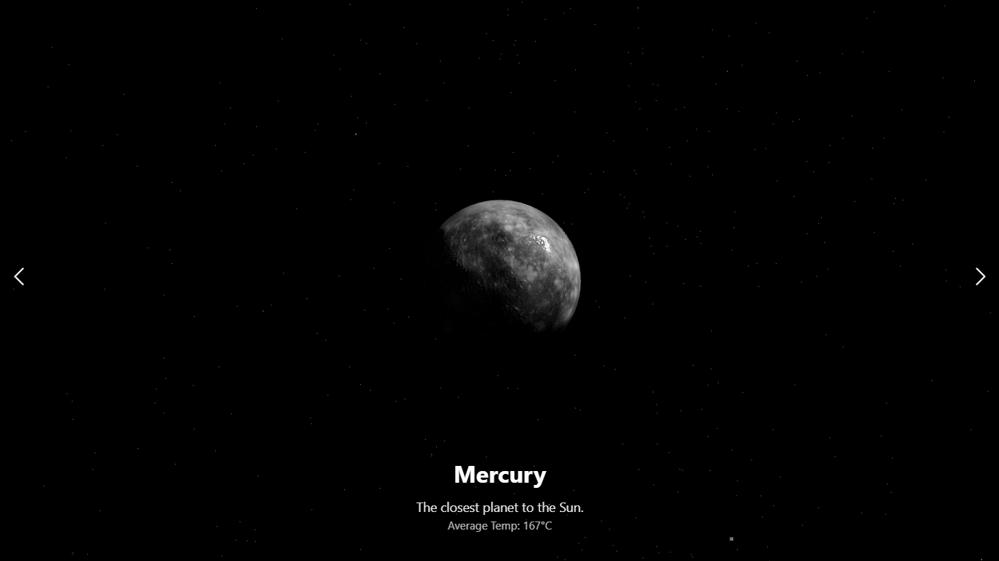

# 🌌 Solar System Explorer

A visually immersive **React + Vite + Three.js** experience for exploring the planets of our solar system through 3D models, animated transitions, and a layered cosmic UI.  

## 🚀 Live Demo

👉 [https://Reshatel.github.io/Solar-System](https://Reshatel.github.io/Solar-System)



## 💫 Features

* 🪐 **3D Planet Models**  
  Each celestial body is rendered in GLB format with realistic rotation, scale, and orbital mood.

* 🎛️ **Planetary Slider Navigation**  
  Smooth swiper-based transitions between planets, each accompanied by atmospheric info overlays.

* 🌠 **Starscape Background**  
  Custom-generated star field with slow rotation and subtle blinking logic to enhance cosmic depth.

* 🌀 **Performance-Optimized GLB Loading**  
  Models load dynamically from the `/public/assets/` folder to ensure smooth GitHub Pages compatibility.

## 🧪 Built With

* [React](https://react.dev/)
* [Vite](https://vitejs.dev/)
* [Three.js](https://threejs.org/) via `@react-three/fiber`
* [Framer Motion](https://www.framer.com/motion/)
* [Swiper](https://swiperjs.com/)
* GitHub Pages Deployment

## 🚀 Setup & Local Dev

```bash
npm install
npm run dev
